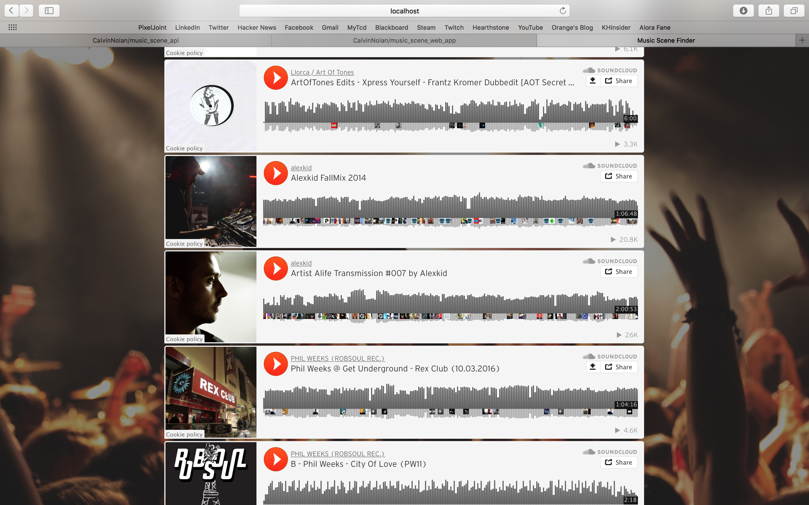

# Music Scene Web App
This is the repo for the web application that is dependant on the <a href="https://github.com/CalvinNolan/music_scene_api">Music Scene API</a>

# Installation
This Web App is written in Node.js, download it <a href="https://nodejs.org/en/">here</a>.

After cloning the repo run ```npm install``` in the music_scene_web_app directory.

Next run ```node index.js``` and the web app will be hosted at ```localhost:3030```, ensure you have the <a href="https://github.com/CalvinNolan/music_scene_api">Music Scene API</a> running for the app to work.

# Preview


<p>The Web App homepage</p>
<br>

<p style="text-align:center">A searched Playlist</p>
<br>

<p>The body of a searched Playlist</p>
